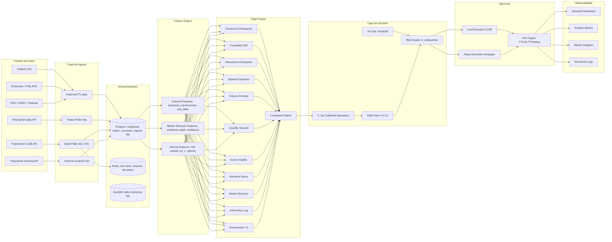
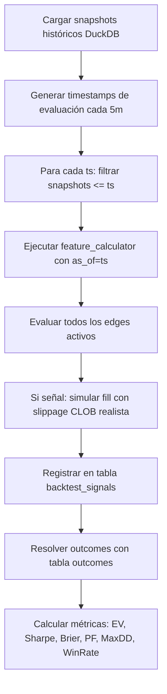

# umbraNocti — Plan de Reestructuración v2.0

> **Ingeniero cuantitativo senior**: documento maestro de arquitectura para operar 24/7 en Polymarket con EV neto positivo, autoaprendizaje y mínima intervención humana.
>
> Estado actual del código auditado: **Día 5 completado**. Una sola estrategia activa (OverreactionV1), paper trading simulado, sin calibración bayesiana, sin feeds externos, sin backtesting offline.

---

## Tabla de Contenidos

1. [Resumen Ejecutivo](#1-resumen-ejecutivo)
2. [Auditoría del Estado Actual](#2-auditoría-del-estado-actual)
3. [Arquitectura Objetivo](#3-arquitectura-objetivo)
4. [Pipeline de Datos](#4-pipeline-de-datos)
5. [Feature Engine Expandido](#5-feature-engine-expandido)
6. [Edge Engine — Tabla Comparativa](#6-edge-engine--tabla-comparativa)
7. [Motor de Señales Compuesto (Edge 12)](#7-motor-de-señales-compuesto-edge-12)
8. [Framework de Backtesting y Walk-Forward](#8-framework-de-backtesting-y-walk-forward)
9. [Aprendizaje Online y Detección de Drift](#9-aprendizaje-online-y-detección-de-drift)
10. [Gestión de Riesgo y Ejecución](#10-gestión-de-riesgo-y-ejecución)
11. [Monitoreo y Alertas](#11-monitoreo-y-alertas)
12. [Pruebas](#12-pruebas)
13. [Checklist de Implementación](#13-checklist-de-implementación)
14. [Métricas y Validación](#14-métricas-y-validación)
15. [Prompt Final para Claude](#15-prompt-final-para-claude)

---

## 1. Resumen Ejecutivo

umbraNocti es un bot de trading cuantitativo que opera sobre Polymarket, mercado de predicción basado en CLOB donde el precio de cada contrato refleja una probabilidad de resolución. El objetivo central es detectar **ineficiencias probabilísticas temporales** y explotarlas de forma sistemática, disciplinada y validada estadísticamente, antes de comprometer capital real.

### Estado tras el Mes 1

La infraestructura base está completamente funcional en 5 días: polling REST cada 30 s sobre la Gamma API, persistencia en Postgres (Neon), hot cache en Redis (Upstash), edge `OverreactionV1` basado en EMA + umbral de 3σ, risk engine de 11 compuertas (kill-switch, drawdown halt/throttle, no-averaging-down, cooldown, liquidez/spread, Kelly, exposure caps), módulo de análisis técnico (OHLC bars en 4 timeframes, trend BULL/BEAR/SIDEWAYS, soporte/resistencia), paper execution con modelo de slippage simple, equity tracking y dashboard Streamlit. El sistema tiene 28+ tests verdes.

Lo que **falta** para operación real y EV positivo robusto:

- Solo un edge activo (Overreaction). Los 11 restantes son conceptos sin código.
- El probability engine es passthrough (EMA como fair price, sin calibración).
- No hay feeds de datos externos (noticias, RSS, encuestas, redes sociales).
- No hay CLOB API integrada (solo Gamma REST; slippage es heurística).
- No hay backtesting offline con datos históricos reales.
- No hay detección de drift ni reentrenamiento.
- No hay alertas automáticas (Telegram, email).
- PnL realizado siempre es cero (outcomes no se resuelven aún).

### Propuesta

La reestructuración se organiza en **cuatro bloques** independientes que pueden desarrollarse en paralelo a partir del Mes 2:

**Bloque A — Validación de OverreactionV1** (Semanas 1-2): acumular 5000+ snapshots, implementar resolución de outcomes, Brier score real, walk-forward con ventanas deslizantes, análisis de sensibilidad de σ_threshold y ema_alpha. Criterio de salida: Brier < 0.20, EV+ después de slippage, degradación walk-forward < 30%.

**Bloque B — Data Engine expandido** (Semanas 2-4): integrar CLOB API para orderbook profundo, WebSocket para latencia real, pipeline ETL de feeds externos (RSS policy, Polymarket Data API para trades históricos). Esto habilita los edges 2, 4, 5, 11.

**Bloque C — Edge Engine completo** (Mes 2-3): implementar edges 2 a 11 en orden de complejidad de datos requeridos: primero los que solo necesitan datos internos de mercado (3, 6, 7, 8, 9, 10), luego los que requieren feeds externos (2, 4, 5, 11). Cada edge tiene su archivo `.md` con hipótesis, señal matemática, pseudocódigo, criterios y métricas.

**Bloque D — Motor compuesto + ML** (Mes 3-4): combinar señales con pesos w₁...wₙ calibrados por EV histórico, implementar P_fair bayesiano (regresión logística como base), añadir detección de drift (CUSUM) y reentrenamiento automático diario. Umbral composite ajustado para Profit Factor > 1.5.

### Restricciones no negociables

1. Ningún edge pasa a producción sin Brier < 0.25 y EV+ en walk-forward.
2. Slippage modelado con CLOB real antes de evaluar rentabilidad.
3. Paper trading mínimo 60 días antes de capital real.
4. Máximo 2-3 hiperparámetros por edge en optimización.
5. El edge compuesto solo se activa cuando ≥ 2 edges individuales están validados.

---

## 2. Auditoría del Estado Actual

### 2.1 Fortalezas del código base

| Componente | Evaluación |
|---|---|
| `risk/engine.py` | Excelente: 11 compuertas en cascada, fail-CLOSED en Redis, auto-halt por DD, cooldown por mercado |
| `risk/sizer.py` | Correcto: Kelly fraccional κ=0.15 para binarios; maneja BUY_YES y BUY_NO simétricamente |
| `features/calculator.py` | Sólido: funciones puras, anti-lookahead verificado con tests, 7 features calculados |
| `ta/` (módulo TA) | Bien estructurado: OHLC en 4 timeframes, trend BULL/BEAR/SIDEWAYS, S/R con min_touches |
| `edges/overreaction.py` | Implementación correcta: EMA sobre historia pasada (excluye punto actual), σ calculado sin contaminar con spike |
| `engine/orchestrator.py` | Pipeline completo: edge → TA gate → probability → risk → paper execute → stream |
| Tests | 28 tests incluyendo anti-lookahead obligatorios y E2E |

### 2.2 Gaps críticos identificados

```
GAP-01  Probability engine es passthrough (fair_price = EMA).
        Impacto: sin calibración, Kelly usa probabilidades no verificadas.
        Solución: regresión logística sobre features + outcomes resueltos.

GAP-02  Sin resolución de outcomes.
        Impacto: PnL realizado = 0, Brier score inválido, validación imposible.
        Solución: job async cada 1h que consulta Gamma para mercados con endDate < now.

GAP-03  Sin CLOB API.
        Impacto: slippage es heurística lineal; orderbook profundo no disponible.
        Solución: integrar https://clob.polymarket.com para edges 6, 8, profundidad real.

GAP-04  Sin feeds externos.
        Impacto: edges 2, 4, 5, 11 son inimplementables.
        Solución: pipeline ETL con RSS feeds, GDELT, Twitter/X API (si accesible).

GAP-05  Sin backtesting offline.
        Impacto: no hay forma de validar edges históricamente antes de paper.
        Solución: script backtest.py con replay deslizante cada 5m sobre snapshots.

GAP-06  Sin detección de drift.
        Impacto: el modelo puede desalinearse del mercado sin alertar.
        Solución: CUSUM sobre distribución de σ de señales y Brier rolling.

GAP-07  Sin alertas externas.
        Impacto: si la API crashea, no hay notificación.
        Solución: Telegram bot con webhooks de eventos críticos.
```

### 2.3 Parámetros actuales del sistema

| Parámetro | Valor | Justificación |
|---|---|---|
| `overreaction_sigma_threshold` | 3.0 | Conservador; espera 3σ antes de señal |
| `ema_alpha` | 0.1 | Suavizado alto; más lento para adaptarse |
| `kelly_kappa` | 0.15 | Fractional Kelly conservador |
| `max_risk_per_trade_usd` | $50 | 5% del bankroll $1,000 |
| `max_exposure_per_market_usd` | $200 | 20% del bankroll |
| `dd_halt_pct` | 15% | Consistent con literatura retail |
| `position_ttl_hours` | 8h | Evita posiciones zombie |
| `stop_loss_pct` | 15% | Por posición |
| `take_profit_pct` | 25% | Por posición |

---

## 3. Arquitectura Objetivo



---

## 4. Pipeline de Datos

### 4.1 Fuentes internas (Polymarket)

| API | Endpoint clave | Datos | Frecuencia |
|---|---|---|---|
| Gamma | `/markets?order=volume24hr` | Mercados activos, metadata | 5 min (universe scan) |
| Gamma | `/markets/{condition_id}` | Book snapshot: bid/ask/spread/liquidez | 30 s (poller actual) |
| CLOB | `/book?token_id={id}` | Orderbook completo: bids/asks con profundidad | 30 s o WS |
| CLOB | `/last-trade-price?token_id={id}` | Último precio de trade | on-demand |
| Data | `/activity?market={id}` | Historial de trades con timestamps | 60 s |

**Migración a WebSocket (CLOB)**: el endpoint WS de Polymarket CLOB emite eventos `book` y `price_change` en tiempo real. Reemplazar el polling de 30s por WS reduce latencia de ~15s a <1s para edge 2 (Information Lag) y edge 6 (Liquidity Vacuum).

### 4.2 Fuentes externas (ETL diario)

| Fuente | Datos | Edge que habilita |
|---|---|---|
| GDELT Events API | Eventos globales con geolocalización, mencion/hora | 4, 5, 11 |
| RSS gubernamentales | Comunicados oficiales, elecciones, regulaciones | 2, 11 |
| NewsAPI / MediaStack | Noticias en tiempo real por keyword | 2, 4 |
| Metaculus API | Probabilidades externas de expertos | 11 |
| PredictIt (scrapeable) | Mercados de predicción alternativos | 3, 11 |
| Google Trends | Volumen de búsqueda por keyword | 4 |
| Twitter/X API v2 | Menciones, sentiment, velocidad narrativa | 4, 5 |

**Esquema ETL**:
```
Scheduler (cron diario 00:00 UTC)
  → fetch_gdelt_events(keywords=mercados_activos)
  → normalize_to_ExternalEvent(source, event_ts, sentiment_score, mentions_count)
  → INSERT INTO external_events (market_id_guess, source, event_ts, sentiment, mentions)
  → cache en Redis: ext:{market_id}:latest (TTL 6h)
```

### 4.3 Almacenamiento histórico (DuckDB)

Para backtesting y walk-forward, los snapshots se exportan periódicamente a DuckDB para consultas analíticas OLAP de alta velocidad:

```sql
-- Exportar snapshots a DuckDB para backtest
COPY (
  SELECT bs.*, m.question, m.end_date
  FROM book_snapshots bs
  JOIN markets m ON m.condition_id = bs.market_id
  ORDER BY bs.ts
) TO 'data/snapshots.parquet' (FORMAT PARQUET);
```

---

## 5. Feature Engine Expandido

### 5.1 Features actuales (ya implementados en `features/calculator.py`)

| Feature | Cálculo | Nota |
|---|---|---|
| `mid_price` | `(bid + ask) / 2` | Con fallback a last_trade_price |
| `spread` | `ask - bid` | Absoluto en unidades de probabilidad |
| `delta_p_1m` | `mid(t) - mid(t-1m)` | Momentum corto |
| `delta_p_5m` | `mid(t) - mid(t-5m)` | Momentum medio |
| `spread_expansion` | z-score spread vs últimos 5m | Detecta volatilidad anómala |
| `vol_z` | z-score vol_24h vs últimos 30m | Detecta interés repentino |
| `mid_velocity` | `Δmid / Δt` en bps/segundo | Derivada instantánea |

### 5.2 Features nuevos requeridos

| Feature | Cálculo | Edge que usa | Requiere |
|---|---|---|---|
| `bid_ask_imbalance` | `(bid_depth - ask_depth) / (bid_depth + ask_depth)` | 6, 7 | CLOB API |
| `orderbook_depth` | Suma de volumen en top 5 niveles de cada lado | 6 | CLOB API |
| `price_impact_10usd` | Slippage estimado para $10 en el CLOB real | 6, 8 | CLOB API |
| `vol_acceleration` | `vol_z(t) - vol_z(t-5m)` | 7, 9 | Cálculo sobre vol_z |
| `momentum_deceleration` | `velocity(t) - velocity(t-5m)` | 9 | Cálculo sobre velocity |
| `prob_z_historical` | z-score de mid vs últimos N días | 10 | Histórico largo (DuckDB) |
| `sentiment_score` | Media ponderada de score de noticias (−1..+1) | 4, 5 | ETL externo |
| `mentions_per_hour` | Velocidad de menciones en Twitter/RSS | 4 | ETL externo |
| `mentions_decay_ratio` | `mentions(t) / mentions(t-6h)` | 4 | ETL externo |
| `poll_delta` | `mid_price - poll_probability` | 11 | API encuestas |
| `time_to_resolution_h` | Horas hasta `end_date` del mercado | 5, todos | Gamma metadata |
| `market_category` | Categoría (política/deportes/cripto) | Filtro universe | Clasificador texto |

### 5.3 Anti-lookahead obligatorio

Todos los features nuevos deben pasar el test anti-lookahead del directorio `tests/leakage/`. Regla: ningún cálculo puede usar snapshots con `ts > as_of`. El decorator de test existente se reutiliza:

```python
def test_no_lookahead_new_feature():
    future_snap = SnapshotInput(ts=as_of + timedelta(seconds=1), ...)
    history = [...valid_snaps..., future_snap]
    features = calculate_features_v2(history, as_of)
    # feature calculado NO debe incluir future_snap
    assert features.bid_ask_imbalance == expected_without_future
```

---

## 6. Edge Engine — Tabla Comparativa

| # | Edge | Hipótesis central | Señal principal | Acción | Features | Docs |
|---|---|---|---|---|---|---|
| 1 | **Overreaction** | Retail sobre-reacciona a noticias; precio revierte a su EMA | `ORS = (mid - EMA) / σ_recent` > 3 | Contra-tendencia | mid, EMA, σ | [edge_01](edges/edge_01_overreaction.md) |
| 2 | **Information Lag** | Información pública relevante no incorporada aún | `Lag = T_event - T_market_move` > θ₂ horas | En dirección de la info | mentions_per_hour, mid_velocity | [edge_02](edges/edge_02_information_lag.md) |
| 3 | **Market Structure** | Inconsistencia probabilística entre mercados relacionados | `Inconsistency = \|ΣP_i - 1\|` > θ₃ | Arbitraje; comprar el sub-valuado | mid_price multi-market | [edge_03](edges/edge_03_market_structure.md) |
| 4 | **Narrative Decay** | La narrativa emocional decae más rápido que el precio | `ND = mentions(t) / mentions(t-6h)` < θ₄ | Reversión post-euforia | mentions_decay_ratio, sentiment | [edge_04](edges/edge_04_narrative_decay.md) |
| 5 | **Event Volatility** | Pre-evento se sobre-hedge; post-evento compresión | `VolShock = σ_pre_event / σ_base` > θ₅ | Comprar compresión post-evento | time_to_resolution, vol_z | [edge_05](edges/edge_05_event_volatility.md) |
| 6 | **Liquidity Vacuum** | Órdenes grandes en libro delgado generan over-shoot | `Vacuum = ΔP / (bid_depth + ask_depth)` > θ₆ | Reversión post-impact | orderbook_depth, price_impact | [edge_06](edges/edge_06_liquidity_vacuum.md) |
| 7 | **Volume Anomaly** | Picos de volumen anormales anticipan movimientos | `VolumeZ = (vol - μ) / σ` > θ₇ | En dirección del movimiento si confirmado | vol_z, vol_acceleration | [edge_07](edges/edge_07_volume_anomaly.md) |
| 8 | **Spread Expansion** | Spread amplio indica incertidumbre temporal | `SpreadExp = spread(t) / spread_avg` > θ₈ | Esperar contracción; entrar con menor costo | spread_expansion | [edge_08](edges/edge_08_spread_expansion.md) |
| 9 | **Momentum Exhaustion** | Tendencias fuertes pierden aceleración antes de revertir | `Exhaust = velocity(t) - velocity(t-5m)` < θ₉ | Contra-tendencia en desaceleración | mid_velocity, momentum_deceleration | [edge_09](edges/edge_09_momentum_exhaustion.md) |
| 10 | **Probability Drift** | Precios extremos revierten a media histórica | `Drift = (mid - μ_hist) / σ_hist` fuera de ±2σ | Reversión a media | prob_z_historical | [edge_10](edges/edge_10_probability_drift.md) |
| 11 | **Consensus Divergence** | Mercado diverge de consenso externo verificable | `Divergence = \|mid - poll_probability\|` > θ₁₁ | Convergencia hacia consenso | poll_delta, sentiment | [edge_11](edges/edge_11_consensus_divergence.md) |
| 12 | **Composite** | Combinar edges reduce dependencia de un patrón único | `Score = Σ wᵢ · Eᵢ_score` > θ_composite | Decisión ponderada final | Todos los anteriores | [edge_12](edges/edge_12_composite.md) |

---

## 7. Motor de Señales Compuesto (Edge 12)

### 7.1 Arquitectura del Composite

El composite no reemplaza los edges individuales — los **agrega** con pesos calibrados por EV histórico.

```python
# Pseudocódigo: composite_engine.py

@dataclass
class CompositeSignal:
    side: str          # BUY_YES | BUY_NO
    score: float       # 0..1 (agregado ponderado)
    confidence: float  # promedio ponderado de confianzas individuales
    edges_active: list[str]  # qué edges contribuyeron

def compute_composite(
    market_id: str,
    snapshots: list[SnapshotInput],
    external_data: ExternalFeatures | None,
    as_of: datetime,
    weights: dict[str, float],  # calibrados en backtest
) -> CompositeSignal | None:
    
    signals: list[tuple[str, float, str]] = []  # (edge_name, score, side)

    # Evaluar cada edge activo y validado
    if e1 := overreaction.detect(snapshots, as_of):
        signals.append(("overreaction", abs(e1.strength) / 6.0, e1.side))
    
    if e6 := liquidity_vacuum.detect(snapshots, as_of):
        signals.append(("liquidity_vacuum", e6.score, e6.side))
    
    # ... otros edges ...

    if not signals:
        return None

    # Verificar coherencia de dirección: si hay conflicto severo, rechazar
    sides = [s for _, _, s in signals]
    if sides.count("BUY_YES") > 0 and sides.count("BUY_NO") > 0:
        # Conflicto: no señal, o solo si mayoría fuerte
        if abs(sides.count("BUY_YES") - sides.count("BUY_NO")) <= 1:
            return None  # empate → incertidumbre

    # Lado mayoritario
    dominant_side = max(set(sides), key=sides.count)

    # Score compuesto ponderado (solo edges en dirección dominante)
    aligned = [(name, score) for name, score, side in signals if side == dominant_side]
    total_weight = sum(weights.get(name, 1.0) for name, _ in aligned)
    composite_score = sum(score * weights.get(name, 1.0) for name, score in aligned) / total_weight

    return CompositeSignal(
        side=dominant_side,
        score=composite_score,
        confidence=len(aligned) / len(signals),  # fracción de edges alineados
        edges_active=[name for name, _ in aligned],
    )
```

### 7.2 Calibración de pesos

Los pesos `wᵢ` se calibran por **EV histórico por edge** en walk-forward:

```python
weights = {
    edge_name: max(0.0, ev_per_signal)  # EV negativo → peso 0
    for edge_name, ev_per_signal in ev_results.items()
}
# Normalizar
total = sum(weights.values()) or 1.0
weights = {k: v / total for k, v in weights.items()}
```

### 7.3 Threshold del composite

El `threshold_composite` se calibra en backtest para maximizar `Profit Factor` con `MaxDD < 10%`:

```
Profit Factor = Σ(ganancias brutas) / Σ(pérdidas brutas)
Objetivo: PF > 1.5 en out-of-sample
```

---

## 8. Framework de Backtesting y Walk-Forward

### 8.1 Arquitectura del backtester



**Script**: `infra/backtest.py`

```python
# Pseudocódigo: backtest engine

async def run_backtest(
    condition_ids: list[str],
    start_ts: datetime,
    end_ts: datetime,
    step_minutes: int = 5,
    slippage_model: SlippageModel = CLOBSlippageModel(),
) -> BacktestReport:
    
    duckdb_conn = duckdb.connect("data/snapshots.db")
    results: list[BacktestTrade] = []
    
    current_ts = start_ts
    while current_ts <= end_ts:
        for condition_id in condition_ids:
            # Anti-lookahead: solo snapshots <= current_ts
            snaps = load_from_duckdb(duckdb_conn, condition_id, current_ts)
            
            edge_output = detect_overreaction(snaps, current_ts)  # extendible a composite
            if edge_output is None:
                current_ts += timedelta(minutes=step_minutes)
                continue
            
            # Simular fill con slippage del CLOB (o heurística si CLOB no disponible)
            fill_price = slippage_model.fill(
                side=edge_output.side,
                market_price=edge_output.market_price,
                notional_usd=10.0,  # tamaño fijo para backtest neutro
            )
            
            # Buscar outcome resuelto
            outcome = lookup_outcome(duckdb_conn, condition_id, current_ts)
            if outcome is not None:
                pnl = compute_pnl(edge_output.side, fill_price, outcome)
                results.append(BacktestTrade(..., pnl=pnl))
        
        current_ts += timedelta(minutes=step_minutes)
    
    return BacktestReport.from_trades(results)
```

### 8.2 Walk-Forward

```python
def walk_forward_analysis(
    all_snapshots,
    all_outcomes,
    n_splits: int = 5,
    train_pct: float = 0.6,
) -> list[WalkForwardResult]:
    
    results = []
    total_days = (max_ts - min_ts).days
    window_days = total_days // n_splits
    
    for i in range(n_splits - 1):
        train_end = min_ts + timedelta(days=window_days * (i + 1))
        test_start = train_end
        test_end = test_start + timedelta(days=int(window_days * (1 - train_pct)))
        
        # Calibrar sigma_threshold en train
        best_threshold = calibrate_threshold(
            snapshots[train_start:train_end],
            outcomes,
            param_range=np.arange(2.0, 5.0, 0.5),
        )
        
        # Evaluar en test (out-of-sample, sin reoptimizar)
        test_metrics = evaluate_edge(
            snapshots[test_start:test_end],
            outcomes,
            sigma_threshold=best_threshold,
        )
        
        results.append(WalkForwardResult(
            period=f"{test_start.date()} – {test_end.date()}",
            threshold=best_threshold,
            brier=test_metrics.brier,
            ev=test_metrics.ev_per_signal,
            sharpe=test_metrics.sharpe,
        ))
    
    return results
```

**Criterio de validación**: si la diferencia de EV entre el mejor split de train y el peor split de test supera el 30%, el edge no está validado.

---

## 9. Aprendizaje Online y Detección de Drift

### 9.1 Modelo P_fair calibrado

Reemplazar el passthrough actual en `engine/probability.py` por un modelo de calibración incremental:

```python
# Fase 1 (Mes 2): regresión logística sobre features observables
# Fase 2 (Mes 3+): calibración isotónica sobre predicciones del modelo

class PFairCalibrator:
    """
    Entrena un modelo logístico que mapea features → P(outcome=YES).
    Reentrenamiento diario con datos recientes.
    """
    def __init__(self):
        self.model = LogisticRegression(max_iter=1000)
        self.scaler = StandardScaler()
        self._fitted = False
    
    def fit(self, X: np.ndarray, y: np.ndarray):
        X_scaled = self.scaler.fit_transform(X)
        self.model.fit(X_scaled, y)
        self._fitted = True
    
    def predict(self, features: FeatureSet) -> float:
        if not self._fitted:
            return features.mid_price  # fallback passthrough
        X = np.array([[
            features.mid_price,
            features.spread_expansion or 0,
            features.vol_z or 0,
            features.delta_p_5m or 0,
        ]])
        return float(self.model.predict_proba(self.scaler.transform(X))[0, 1])
```

### 9.2 Detección de drift (CUSUM)

```python
class CUSUMDriftDetector:
    """
    Page-Hinkley / CUSUM: detecta cambios en la distribución
    de la señal σ (strength) o del Brier rolling.
    Trigger: activar reentrenamiento y revisar threshold.
    """
    def __init__(self, delta: float = 0.5, threshold: float = 10.0):
        self.delta = delta
        self.threshold = threshold
        self._sum_pos = 0.0
        self._sum_neg = 0.0
    
    def update(self, value: float) -> bool:
        """Devuelve True si detectó drift."""
        self._sum_pos = max(0.0, self._sum_pos + value - self.delta)
        self._sum_neg = max(0.0, self._sum_neg - value - self.delta)
        if self._sum_pos > self.threshold or self._sum_neg > self.threshold:
            self._sum_pos = 0.0
            self._sum_neg = 0.0
            return True
        return False
```

**Triggers de reentrenamiento**:

| Trigger | Condición | Acción |
|---|---|---|
| Brier drift | CUSUM sobre Brier rolling 7d detecta cambio | Reentrenar modelo P_fair |
| Sigma drift | Distribución de σ de señales cambia > 2σ hist | Recalibrar `sigma_threshold` |
| Volume regime | `vol_z` promedio > 3σ por >24h | Reducir `kelly_kappa` temporalmente |
| Market structure | Spread promedio × 2 vs media histórica | Subir `max_spread_for_entry` |

---

## 10. Gestión de Riesgo y Ejecución

### 10.1 Risk Engine actual (ya implementado — mantener)

El `risk/engine.py` actual implementa correctamente las 11 compuertas. No se modifica la lógica, solo se añaden las compuertas 12 y 13:

```
12. max_time_to_resolution: rechazar si time_to_resolution < 2h (config: max_time_to_resolution_hours_floor)
13. composite_score_min: si se usa Edge 12, rechazar si composite_score < min_composite_threshold
```

### 10.2 Sizing Kelly modificado (ya implementado — documentar extensión)

Extensión para **portfolio Kelly** (no solo per-trade):

```python
def size_position_portfolio_aware(
    side: str,
    p_fair_yes: float,
    market_price_yes: float,
    current_gross_exposure: float,
    bankroll: float,
    kappa: float = 0.15,
    max_portfolio_risk_pct: float = 0.10,
) -> SizingResult:
    base = size_position(side, p_fair_yes, market_price_yes, bankroll, kappa)
    
    # Cap por riesgo portfolio total: nunca superar 10% simultáneo
    portfolio_risk_used = current_gross_exposure / bankroll
    portfolio_risk_remaining = max_portfolio_risk_pct - portfolio_risk_used
    if portfolio_risk_remaining <= 0:
        return SizingResult(f_star=0, shares=0, notional_usd=0)
    
    max_notional_portfolio = portfolio_risk_remaining * bankroll
    if base.notional_usd > max_notional_portfolio:
        ratio = max_notional_portfolio / base.notional_usd
        return SizingResult(
            f_star=base.f_star,
            shares=base.shares * ratio,
            notional_usd=max_notional_portfolio,
        )
    return base
```

### 10.3 Modelo de slippage CLOB realista

Reemplazar la heurística lineal por modelo basado en orderbook real:

```python
def compute_slippage_clob(
    side: str,              # BUY_YES | BUY_NO
    notional_usd: float,
    orderbook: CLOBSnapshot,  # bids/asks con precio y cantidad
) -> float:
    """
    Calcula el precio de fill promedio ponderado caminando el libro.
    Devuelve slippage en bps.
    """
    levels = orderbook.asks if side == "BUY_YES" else orderbook.bids
    remaining = notional_usd
    total_cost = 0.0
    total_shares = 0.0
    
    for price, size_usd in levels:
        fill_usd = min(remaining, size_usd)
        fill_shares = fill_usd / price
        total_cost += fill_usd
        total_shares += fill_shares
        remaining -= fill_usd
        if remaining <= 0:
            break
    
    if total_shares == 0:
        return 500.0  # slippage máximo si no hay liquidez
    
    avg_fill = total_cost / total_shares
    mid = (orderbook.best_bid + orderbook.best_ask) / 2
    slippage_bps = abs(avg_fill - mid) / mid * 10_000
    return min(slippage_bps, 500.0)
```

---

## 11. Monitoreo y Alertas

### 11.1 Métricas en tiempo real (Grafana)

| Métrica | Tipo | Alerta |
|---|---|---|
| `umbra_signals_total{accepted}` | Counter | — |
| `umbra_pnl_unrealized_usd` | Gauge | < −$100 |
| `umbra_drawdown_pct` | Gauge | > 10% |
| `umbra_brier_rolling_7d` | Gauge | > 0.25 |
| `umbra_positions_open` | Gauge | > 15 |
| `umbra_api_errors_total` | Counter | rate > 5/min |
| `umbra_kill_switch_active` | Gauge | == 1 |

**Exposición**: añadir endpoint `/metrics` (formato Prometheus) en `api/app.py`:

```python
from prometheus_client import Counter, Gauge, generate_latest

signals_counter = Counter("umbra_signals_total", "Signals", ["accepted"])
drawdown_gauge = Gauge("umbra_drawdown_pct", "Current drawdown %")

@app.get("/metrics")
async def metrics():
    return Response(generate_latest(), media_type="text/plain")
```

### 11.2 Alertas Telegram

```python
class TelegramAlerter:
    async def alert(self, level: str, message: str):
        # level: INFO | WARNING | CRITICAL
        emoji = {"INFO": "ℹ️", "WARNING": "⚠️", "CRITICAL": "🚨"}[level]
        text = f"{emoji} *umbraNocti* [{level}]\n{message}"
        await httpx_client.post(
            f"https://api.telegram.org/bot{TOKEN}/sendMessage",
            json={"chat_id": CHAT_ID, "text": text, "parse_mode": "Markdown"},
        )
```

**Eventos que generan alerta**:
- Kill-switch activado (CRITICAL)
- DD > 10% (WARNING) y > 15% (CRITICAL + halt automático ya implementado)
- API Polymarket error rate > 5/min (WARNING)
- Drift detectado (WARNING + reentrenamiento iniciado)
- Posición TTL expirada sin cierre (INFO)

---

## 12. Pruebas

### 12.1 Matriz de cobertura objetivo

| Tipo | Objetivo | Archivos |
|---|---|---|
| Unitarios | Cada función de feature, cada edge aislado | `tests/unit/test_features_v2.py`, `tests/unit/test_edge_*.py` |
| Anti-lookahead | Todos los features nuevos | `tests/leakage/test_no_lookahead_v2.py` |
| Integración | Flujo completo orchestrator → fill | `tests/test_orchestrator_*.py` (existentes) |
| Risk engine | Cada compuerta por separado + combinaciones | `tests/test_risk_engine.py` |
| Backtester | Con snapshots sintéticos conocidos | `tests/test_backtest_engine.py` |
| Walk-forward | División temporal correcta | `tests/test_walk_forward.py` |
| Composite | Suma ponderada coherente, manejo de conflictos | `tests/test_composite_engine.py` |
| Slippage CLOB | Caminata del libro con múltiples niveles | `tests/test_slippage_clob.py` |
| Stress | Shock de precio 50% en un tick | `tests/test_stress_shock.py` |

### 12.2 Test de stress obligatorio

```python
def test_market_shock_doesnt_blow_up():
    """Un spike del 50% en un tick no debe hacer que el sistema entre en pánico."""
    snaps = generate_stable_history(n=20, price=0.45)
    shock = SnapshotInput(ts=as_of, best_bid=0.67, best_ask=0.69, ...)
    snaps.append(shock)
    
    signal = detect_overreaction(snaps, as_of)
    assert signal is not None  # debe detectar
    assert signal.side == "BUY_NO"  # debe ir en contra
    
    # Risk engine debe limitar, no rechazar por Kelly si hay edge
    risk = await check(session, condition_id, signal.edge_value, sizing)
    assert risk.adjusted_notional_usd <= settings.max_risk_per_trade_usd
    assert risk.adjusted_notional_usd > 0
```

---

## 13. Checklist de Implementación

### Bloque A — Validación Overreaction (Semanas 1-2)
- [x] Job async de resolución de outcomes (Gamma, cada 1h) — `validation/outcome_resolver.py` + `scheduler/outcomes_loop.py`
- [x] Backfill outcomes para mercados ya cerrados en `markets` — el resolver barre todo `end_date < now` sin outcome
- [~] Métricas reales: Brier, Hit Rate, EV, Sharpe — `backtest/metrics.py` (falta wiring al dashboard Streamlit)
- [x] Script `infra/backtest.py` con replay deslizante 5m — `scripts/run_backtest.py` + `backtest/engine.py`
- [x] Walk-forward con N splits temporales — `backtest/walk_forward.py`
- [x] Análisis de sensibilidad: σ_threshold ∈ {2.5,3.0,3.5,4.0}, EMA_alpha ∈ {0.05,0.10,0.15} — `walk_forward.calibrate`
- [ ] Documento `FINDINGS_W1.md` con decisión go/no-go — requiere datos reales acumulados

### Bloque B — Data Engine expandido (Semanas 2-4)
- [ ] Integrar CLOB API: orderbook profundo y último trade price
- [ ] Migrar poller a WebSocket CLOB (fallback REST si WS cae)
- [ ] Pipeline ETL externo: RSS gubernamentales + GDELT + NewsAPI
- [ ] Tabla `external_events` en Postgres + cache Redis
- [ ] Exportar snapshots a DuckDB/Parquet para backtest
- [ ] Tests de integración para cada nueva fuente de datos

### Bloque C — Edges 2-11 (Mes 2-3)
- [ ] `edges/market_structure.py` (solo datos internos, primer edge nuevo)
- [ ] `edges/liquidity_vacuum.py` (requiere CLOB)
- [ ] `edges/volume_anomaly.py` (vol_z ya disponible)
- [ ] `edges/spread_expansion.py` (spread_expansion ya disponible)
- [ ] `edges/momentum_exhaustion.py` (velocity + aceleración)
- [ ] `edges/probability_drift.py` (requiere DuckDB histórico largo)
- [ ] `edges/information_lag.py` (requiere ETL externo)
- [ ] `edges/narrative_decay.py` (requiere Twitter/RSS)
- [ ] `edges/event_volatility.py` (requiere time_to_resolution + vol_z)
- [ ] `edges/consensus_divergence.py` (requiere encuestas API)
- [ ] Tests anti-lookahead por cada edge nuevo
- [ ] Backtest individual de cada edge antes de activar en producción

### Bloque D — Motor compuesto + ML (Mes 3-4)
- [ ] `edges/composite.py` con pesos calibrables
- [ ] `engine/probability.py`: reemplazar passthrough por LogisticRegression
- [ ] Job de reentrenamiento diario P_fair
- [ ] `engine/drift_detector.py` con CUSUM
- [ ] Endpoint `/metrics` Prometheus
- [ ] Integración Grafana (docker-compose con Grafana container)
- [ ] Alertas Telegram: kill-switch, DD, drift
- [ ] Tests de composite y drift detector

---

## 14. Métricas y Validación

### 14.1 Criterios de aceptación por edge

| Métrica | Umbral mínimo | Umbral objetivo |
|---|---|---|
| **Brier Score** | < 0.25 | < 0.20 |
| **EV por señal** | > 0 después de slippage | > 0.005 USD/señal |
| **Profit Factor** | > 1.2 | > 1.5 |
| **Sharpe ratio** (paper 30d) | > 0.5 | > 1.0 |
| **Max Drawdown** | < 15% | < 10% |
| **Win Rate ajustado** | > 45% (con EV+) | > 52% |
| **Walk-forward degradación** | < 50% de EV | < 30% |
| **Sensibilidad σ** | No colapsa en ±20% | Estable en ±40% |

### 14.2 Criterios NO negociables para live trading

1. ≥ 90 días de paper trading continuo con outcomes resueltos.
2. Brier score sostenido < 0.20 en los últimos 30 días.
3. Sharpe paper > 1.0 después de slippage CLOB modelado.
4. Walk-forward: degradación < 20% entre el mejor train y el peor test.
5. Max drawdown paper < 15%.
6. Circuit breakers activos y testeados en stress tests.
7. Sensibilidad de parámetros: edge funciona con ±20% de cada hiperparámetro.
8. Reconciliación on-chain implementada y verificada.
9. Alertas Telegram funcionando para eventos CRITICAL.
10. Composite Edge validado con ≥ 2 edges individuales activos.

**Si UNA condición falla → no se opera con dinero real. Sin excepciones.**

---

## 15. Prompt Final para Claude

```
Rol:
Actúa como un ingeniero cuantitativo senior especialista en trading algorítmico
y diseño de sistemas de trading automatizado sobre mercados de predicción.

Contexto:
Eres responsable de reestructurar el bot umbraNocti (GG/Umbra PMM) que opera
en Polymarket. El sistema está basado en Python 3.11 con FastAPI, PostgreSQL,
Redis, SQLAlchemy async y Streamlit. La infraestructura base está completada:
polling REST de la Gamma API cada 30s, feature engine con 7 indicadores (mid,
spread, delta_p_1m, delta_p_5m, spread_expansion, vol_z, mid_velocity), edge
OverreactionV1 (EMA + σ threshold = 3.0), risk engine de 11 compuertas (kill-
switch Redis fail-CLOSED, drawdown halt/throttle, no-averaging-down, cooldown
post-exit, liquidez/spread gates, Kelly sizer κ=0.15, exposure caps), módulo
TA con análisis de tendencia BULL/BEAR/SIDEWAYS y soporte/resistencia, exit
engine con stop-loss/take-profit/trailing/TTL, y paper execution con slippage
heurístico. Hay 28+ tests verdes incluyendo anti-lookahead obligatorios.

Lo que falta: solo un edge activo, probability engine passthrough (EMA =
fair price, sin calibración), sin CLOB API, sin feeds externos (noticias/
encuestas/social), sin backtesting offline, sin detección de drift, sin
alertas externas, PnL realizado = 0 (outcomes no resueltos aún).

El código fuente está en src/umbra/. Los documentos de arquitectura están en
docs/RESTRUCTURE_PLAN.md y docs/edges/.

Audiencia:
Tu respuesta será revisada por el equipo técnico: desarrolladores backend
(Python async, SQLAlchemy, FastAPI), ingenieros DevOps (Docker, VPS Linux,
cron) y analistas cuantitativos. Asume conocimiento sólido del dominio.

Tarea:
Implementa el siguiente componente de la arquitectura objetivo, siguiendo
estrictamente la filosofía del sistema:

1. No agregar complejidad sin validación estadística previa.
2. No implementar edges 2-11 hasta que edge 1 (Overreaction) esté validado
   con Brier < 0.20 y EV+ en walk-forward (ver docs/RESTRUCTURE_PLAN.md §8).
3. Tests anti-lookahead son obligatorios para cualquier feature nuevo.
4. El risk engine (src/umbra/risk/engine.py) no se modifica en lógica;
   solo se extienden sus compuertas añadiendo nuevas al final.
5. Mantener compatibilidad con los 28 tests existentes.

[INSERTAR AQUÍ EL COMPONENTE ESPECÍFICO A IMPLEMENTAR, POR EJEMPLO:
  "Implementa el job de resolución de outcomes: job async cada 1h que
   consulta Gamma para mercados con end_date < now, registra resultado
   en tabla outcomes (market_id, resolved_at, outcome_yes 0/1), y
   actualiza realized_pnl en PaperPosition. Incluye tests."
]

Formato de salida:
- Código Python completo, listo para integrar en src/umbra/
- Tests en tests/ siguiendo la convención existente (pytest + pytest-asyncio)
- Si se añaden columnas a la DB, incluir migración Alembic
- Pseudocódigo para lógica compleja antes del código final
- No agregar comentarios obvios; solo comentar el "por qué" no evidente
- Respetar el estilo existente: async/await, structlog, pydantic-settings,
  SQLAlchemy 2.0 async, funciones puras donde sea posible

Restricciones:
- No alterar lógica de negocio sin justificación estadística en el commit
- No recomendar prácticas de manipulación de mercado (spoofing, wash trading)
- No introducir dependencias nuevas sin justificar en requirements.txt
- Máximo 2-3 hiperparámetros nuevos por componente; documentarlos en config.py
- Todo el código en español de docstrings y comentarios; nombres de variables
  en inglés (convención existente del proyecto)

Tono y Estilo:
Técnico, directo. Voz activa. Código limpio sobre código comentado.
Preferir composición sobre herencia. No generar código de prueba o scaffold
que no sea funcional y testeable inmediatamente.
```

---

*Documento generado el 2026-06-05. Siguiente revisión al completar `FINDINGS_W1.md`.*
